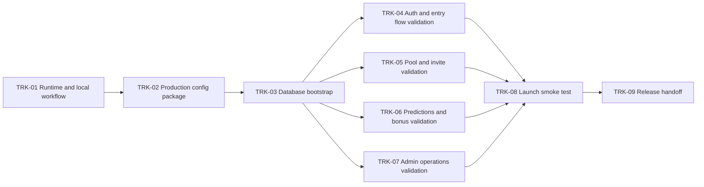

# Bolao Launch Trackers

## Objective

Get a functional version into production fast, with cards separated by dependency so work can run in parallel without creating rework later.

## Ground Rules

- Ignore hosting validation for now. The `kartops` environment already proves the hosting model and local PHP workflow.
- Treat manual admin result entry as part of v1. `cron/fetch_results.php` is explicitly post-launch.
- Prefer cards that end in a deploy-safe artifact: code ready, data ready, checklist ready, or validated flow.

## Dependency Map

## Parallel Work Summary

### Can run immediately in parallel after `TRK-03`

- `TRK-04 Auth and entry flow validation`
- `TRK-05 Pool and invite validation`
- `TRK-06 Predictions and bonus validation`
- `TRK-07 Admin operations validation`

### Should stay sequential

- `TRK-01` -> `TRK-02` -> `TRK-03`
- `TRK-08` depends on `TRK-04` to `TRK-07`
- `TRK-09` depends on `TRK-08`

## Trackers

### TRK-01 Runtime and local workflow

- Type: setup
- Depends on: none
- Blocks: everything else
- Can run in parallel with: nothing relevant
- Goal: standardize how this project is started locally, since PHP is available in your normal environment but not in this session container
- Deliverables:
  - exact local startup command
  - exact DB import command
  - exact base URL used for testing
- Done when:
  - one canonical local runbook exists
  - the team stops treating "PHP not available here" as a product blocker
- Notes:
  - use the same local model as `kartops`
  - likely command is `php -S localhost:8050`

### TRK-02 Production config package

- Type: ops
- Depends on: `TRK-01`
- Blocks: `TRK-03`
- Can run in parallel with: small documentation cleanup only
- Goal: prepare the exact production config values and deployment checklist
- Deliverables:
  - finalized `.env` values for production
  - hosting checklist for FTP upload
  - decision on `MAIL_DRIVER` for launch
- Done when:
  - production `.env` can be filled without guessing
  - deploy operator has a single checklist to follow

### TRK-03 Database bootstrap

- Type: data
- Depends on: `TRK-02`
- Blocks: `TRK-04`, `TRK-05`, `TRK-06`, `TRK-07`
- Can run in parallel with: none of the validation cards
- Goal: ensure schema and seed create a usable World Cup database on the target stack
- Deliverables:
  - imported `sql/schema.sql`
  - imported `sql/seed.sql`
  - confirmation that teams and matches are present
- Done when:
  - first user can register
  - 104 matches and expected teams exist
- Risk to watch:
  - timezone and charset mismatch

### TRK-04 Auth and entry flow validation

- Type: validation
- Depends on: `TRK-03`
- Blocks: `TRK-08`
- Can run in parallel with: `TRK-05`, `TRK-06`, `TRK-07`
- Goal: validate user entry into the system without touching scoring logic
- Scope:
  - register
  - login
  - logout
  - password reset
  - redirect after login
- Done when:
  - a new user can create an account and enter the dashboard
  - a returning user can log in and out
  - password reset path is verified against launch mail decision
- Avoid overlap with:
  - pool creation
  - match prediction
  - admin scoring

### TRK-05 Pool and invite validation

- Type: validation
- Depends on: `TRK-03`
- Blocks: `TRK-08`
- Can run in parallel with: `TRK-04`, `TRK-06`, `TRK-07`
- Goal: validate the social loop of creating and joining private pools
- Scope:
  - create pool
  - copy invite link
  - join by invite
  - list members
  - owner removes member
- Done when:
  - user A creates a pool
  - user B joins from invite
  - both see the same pool and members list
- Avoid overlap with:
  - points calculation rules
  - admin result entry

### TRK-06 Predictions and bonus validation

- Type: validation
- Depends on: `TRK-03`
- Blocks: `TRK-08`
- Can run in parallel with: `TRK-04`, `TRK-05`, `TRK-07`
- Goal: validate the core bettor experience before production
- Scope:
  - save single prediction
  - default prediction
  - fill visible page
  - lock before kickoff
  - bonus picks
- Done when:
  - predictions autosave correctly
  - default score behaves as expected
  - locked matches reject edits server-side
  - bonus picks save and reopen correctly
- Avoid overlap with:
  - ranking correctness under final scores

### TRK-07 Admin operations validation

- Type: validation
- Depends on: `TRK-03`
- Blocks: `TRK-08`
- Can run in parallel with: `TRK-04`, `TRK-05`, `TRK-06`
- Goal: validate all launch-critical admin operations
- Scope:
  - admin dashboard access
  - launch result entry
  - reopen match
  - knockout team assignment
  - tournament bonus answer key
- Done when:
  - admin can enter results
  - recalculation runs without breaking flows
  - knockout editor can assign teams and dates
- Avoid overlap with:
  - member-side UX polish

### TRK-08 Launch smoke test

- Type: integrated validation
- Depends on: `TRK-04`, `TRK-05`, `TRK-06`, `TRK-07`
- Blocks: `TRK-09`
- Can run in parallel with: documentation prep only
- Goal: run one full end-to-end pass on the final environment
- Scope:
  - user registration
  - pool creation
  - invite join
  - predictions
  - bonus
  - admin result entry
  - ranking update
- Done when:
  - one full real-world scenario succeeds without manual DB repair
  - all launch-critical defects are either fixed or explicitly accepted

### TRK-09 Release handoff

- Type: release
- Depends on: `TRK-08`
- Blocks: production release
- Can run in parallel with: communication prep
- Goal: hand off a deploy-safe release packet
- Deliverables:
  - final deploy checklist
  - first admin account owner
  - post-launch operating notes
- Done when:
  - someone can publish and operate the system without asking architecture questions

## Suggested Parallel Lanes

### Lane A

- `TRK-04 Auth and entry flow validation`

### Lane B

- `TRK-05 Pool and invite validation`

### Lane C

- `TRK-06 Predictions and bonus validation`

### Lane D

- `TRK-07 Admin operations validation`

These four lanes are the cleanest split. They share the same prerequisite database state, but after that they do not need to block one another.

## Card Files

- [TRK-01 Runtime and local workflow](/Users/cassiomachado/Documents/Development/bolao/docs/trackers/TRK-01-runtime-and-local-workflow.md)
- [TRK-02 Production config package](/Users/cassiomachado/Documents/Development/bolao/docs/trackers/TRK-02-production-config-package.md)
- [TRK-03 Database bootstrap](/Users/cassiomachado/Documents/Development/bolao/docs/trackers/TRK-03-database-bootstrap.md)
- [TRK-04 Auth and entry flow validation](/Users/cassiomachado/Documents/Development/bolao/docs/trackers/TRK-04-auth-and-entry-flow-validation.md)
- [TRK-05 Pool and invite validation](/Users/cassiomachado/Documents/Development/bolao/docs/trackers/TRK-05-pool-and-invite-validation.md)
- [TRK-06 Predictions and bonus validation](/Users/cassiomachado/Documents/Development/bolao/docs/trackers/TRK-06-predictions-and-bonus-validation.md)
- [TRK-07 Admin operations validation](/Users/cassiomachado/Documents/Development/bolao/docs/trackers/TRK-07-admin-operations-validation.md)
- [TRK-08 Launch smoke test](/Users/cassiomachado/Documents/Development/bolao/docs/trackers/TRK-08-launch-smoke-test.md)
- [TRK-09 Release handoff](/Users/cassiomachado/Documents/Development/bolao/docs/trackers/TRK-09-release-handoff.md)

## What Not To Parallelize

- Do not mix production config edits with validation execution.
- Do not run schema/seed changes while people are validating flows.
- Do not start API automation for results before launch.
- Do not combine UX polish with critical path validation unless a specific bug blocks a flow.

## Immediate Recommendation

Start with only these cards on the board:

1. `TRK-01 Runtime and local workflow`
2. `TRK-02 Production config package`
3. `TRK-03 Database bootstrap`
4. `TRK-04 Auth and entry flow validation`
5. `TRK-05 Pool and invite validation`
6. `TRK-06 Predictions and bonus validation`
7. `TRK-07 Admin operations validation`
8. `TRK-08 Launch smoke test`
9. `TRK-09 Release handoff`

That is enough structure to run fast without inventing dependency debt.
